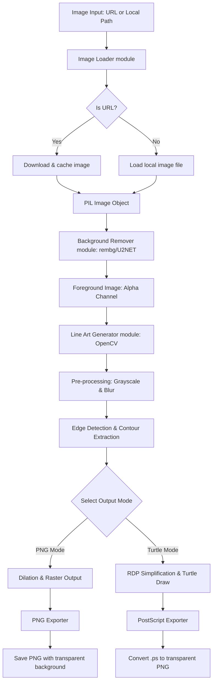

# Đặc Tả Tính Năng: Smart Portrait-to-Sketch Pipeline (Đặc tả Hệ thống Xá»­ lý Ảnh Tranh Vẽ)

Tài liệu này đặc tả chi tiết về hệ thống Python local giúp tải ảnh, tách nền, chuyển đổi sang tranh nét (Line Art) và xuất ra file PNG chất lượng cao.

---

## 1. Kiến Trúc Luồng Dữ Liệu (Data Flow)

Dưới đây là sơ đồ luồng hoạt động từ lúc nhập ảnh đầu vào cho đến khi xuất file PNG hoàn chỉnh:



---

## 2. Các Thành Phần Chính (Core Modules)

### A. Bộ Tải Ảnh (Image Loader)
*   **Thư viện:** `requests` (tải từ internet), `Pillow` (đọc/ghi file ảnh).
*   **Chức năng:**
    *   Tự động phát hiện đầu vào là URL hay đường dẫn thư mục local.
    *   Xử lý lỗi tải ảnh (URL hỏng, không có quyền truy cập, định dạng ảnh không được hỗ trợ).
    *   Tự động chuẩn hóa ảnh về hệ màu RGB/RGBA.

### B. Bộ Tách Nền (Background Remover)
*   **Thư viện:** `rembg` (phiên bản local dùng ONNX Runtime, tự động chạy bằng CPU hoặc GPU nếu có CUDA).
*   **Chức năng:**
    *   Nhận diện chủ thể chính trong bức ảnh (con người, con vật, đồ vật).
    *   Tách biệt chủ thể khỏi nền và trả về ảnh dạng RGBA với nền trong suốt (Alpha = 0).

### C. Bộ Chuyển Đổi Nét Vẽ (Line Art/Sketch Generator)
*   **Thư viện:** `opencv-python`, `numpy`.
*   **Chức năng:**
    *   Chuyển đổi chủ thể đã tách nền thành ảnh xám (Grayscale).
    *   Áp dụng bộ lọc Gauss (Gaussian Blur) để giảm nhiễu hạt.
    *   Sử dụng thuật toán **Adaptive Thresholding** hoặc lọc Canny kết hợp đảo ngược màu (Invert) để tạo ra nét vẽ đen trên nền trắng.
    *   Sử dụng toán tử hình thái học (Morphological Operations - Dilation/Erosion) để điều chỉnh độ dày/mỏng của nét vẽ.
    *   Gộp kênh Alpha gốc của bước tách nền vào ảnh nét vẽ để nét vẽ có nền trong suốt (transparent).

### D. Bộ Xuất File (PNG Exporter)
*   **Thư viện:** `Pillow`.
*   **Chức năng:**
    *   Lưu file dưới định dạng `.png`.
    *   Áp dụng các mức tối ưu hóa nén (compression level 1-9) để dung lượng nhẹ nhất nhưng giữ nguyên chất lượng vector nét vẽ.
    *   Tự động xóa sạch metadata (EXIF) của thiết bị chụp ảnh ban đầu để bảo vệ quyền riêng tư.

### E. Bộ Vẽ Minh Họa Turtle (Turtle Vector Plotter)
*   **Thư viện:** `turtle` (tiêu chuẩn của Python), `opencv-python` (để lấy contours).
*   **Chức năng:**
    *   **Trích xuất Contours:** Dùng `cv2.findContours` để phát hiện các đường bao khép kín hoặc các đường nét chính của hình ảnh xám đã tách nền.
    *   **Đơn giản hóa Vector:** Dùng thuật toán `cv2.approxPolyDP` (Ramer-Douglas-Peucker) để xấp xỉ hóa đường cong thành các đoạn thẳng nối tiếp, lọc bớt các điểm ảnh quá vụn để tránh làm Turtle vẽ quá chậm.
    *   **Mô phỏng Vẽ:** Lần lượt duyệt qua từng Contour, sử dụng lệnh `turtle.penup()`, `turtle.goto(x, y)`, `turtle.pendown()` để vẽ từng nét vẽ chân thực lên màn hình.
    *   **Xuất File Vector:** Xuất kết quả vẽ từ canvas ra file định dạng PostScript (`.ps`), sau đó dùng Pillow để chuyển đổi PostScript sang PNG trong suốt độ phân giải cao.


---

## 3. Giao Diện Người Dùng Đề Xuất (User Interfaces)

Chúng ta có thể hỗ trợ 2 dạng giao diện để dễ dàng vận hành trên máy local:
1.  **Giao diện dòng lệnh (CLI):**
    ```bash
    python main.py --input "https://example.com/art.jpg" --output "./output/sketch.png" --thickness 3 --no-bg
    ```
2.  **Giao diện Web Local (Gradio/Streamlit):**
    *   Người dùng kéo thả ảnh vào web app chạy trên trình duyệt local.
    *   Có thanh trượt điều chỉnh: Độ đậm nét (Thickness), Độ mịn nét (Blur), và Tùy chọn giữ/tách nền.
    *   Hiển thị ảnh so sánh Before/After trực quan.

---

## 4. Thuật Toán Mô Phỏng Nét Vẽ Tay (Human-Like Stroke Simulation)

Để nét vẽ của Rùa trông tự nhiên giống như người vẽ thủ công thay vì các nét vẽ máy móc hoàn hảo, hệ thống sẽ tích hợp các kỹ thuật mô phỏng vật lý sau:

### A. Độ Rung Tay Vật Lý (Hand Jitter Simulation)
*   Thêm một sai số ngẫu nhiên cực nhỏ (Gaussian Noise) vào các tọa độ di chuyển của Rùa:
    $$x_{má»›i} = x + \text{random.gauss}(0, \sigma)$$
    $$y_{má»›i} = y + \text{random.gauss}(0, \sigma)$$
    Trong đó $\sigma$ (độ lệch chuẩn) được cấu hình từ `0.2` đến `0.8` pixel. Điều này tạo ra độ run tự nhiên giống như tay người thật đang vẽ nét.

### B. Biến Thiên Độ Dày Nét Vẽ (Dynamic Pensize)
*   Người vẽ thật thường ấn mạnh bút ở đầu nét vẽ và nhấc nhẹ ở cuối nét vẽ.
*   Hệ thống sẽ thay đổi liên tục kích thước nét vẽ `turtle.pensize()` dựa trên:
    *   **Giai đoạn nét vẽ:** Giảm dần độ dày nét vẽ khi đi về phía cuối đường viền (Contour).
    *   **Độ cong của nét:** Nét thẳng vẽ nhanh -> nét mỏng; nét cong vẽ chậm -> nét dày hơn để mô tả chi tiết khối.

### C. Kỹ Thuật Đánh Bóng Tạo Khối (Hatching & Cross-hatching)
*   Đối với các mảng tối (shadows) trên tranh trắng đen, thay vì để trống, hệ thống sẽ hướng dẫn Rùa vẽ các nét gạch chéo song song (Hatching) hoặc lưới gạch chéo (Cross-hatching).
*   **Thuật toán:** Quét qua các vùng có sắc độ tối trong ảnh gốc, vẽ các đường thẳng song song nghiêng 45 độ với khoảng cách tỉ lệ nghịch với độ tối (càng tối nét gạch càng khít).

---

## 5. Đặc Tả Xử Lý Phong Cảnh Số Hóa (Landscape Digital Processing & Layering)

Tranh phong cảnh số hóa yêu cầu xử lý không gian phức tạp hơn tranh chân dung do có nhiều lớp chiều sâu. Hệ thống áp dụng quy trình xử lý phân lớp:

```
[Ảnh phong cảnh] ──> [K-Means Phân mảng xám] ──> [Sắp xếp chiều sâu] ──> [Turtle vẽ từ xa đến gần]
```

### A. Phân Mảng Tông Màu (Tonal Quantization)
*   Sử dụng thuật toán **K-Means Clustering** trên OpenCV để gom ảnh phong cảnh về từ 4 đến 8 phân độ xám cố định (ví dụ: Trắng, Xám nhạt, Xám trung bình, Xám đậm, Đen).
*   Mỗi phân độ xám sẽ đại diện cho một lớp chiều sâu hoặc một mảng màu số hóa riêng biệt.

### B. Vẽ Phân Lớp Từ Xa Đến Gần (Depth Sorting & Layering)
*   Hệ thống tự động phân loại các đường nét dựa trên vị trí y (trục dọc) và sắc độ để vẽ theo thứ tự:
    1.  **Lớp nền (Background):** Bầu trời, mây, núi ở xa vẽ trước bằng nét mỏng (`pensize=1`) và tốc độ nhanh.
    2.  **Lớp trung cảnh (Midground):** Đồi núi gần, hàng cây, nhà cửa vẽ tiếp theo bằng nét vừa (`pensize=2`).
    3.  **Lớp tiền cảnh (Foreground):** Chi tiết đá, sông, người, cây cối ở gần vẽ cuối cùng bằng nét dày (`pensize=3`) để tạo cảm giác chiều sâu.

### C. Xuất Bản Đồ Số Hóa Tự Tô (Paint-by-Numbers Blueprint)
*   Hệ thống có chế độ xuất ra bản vẽ nét rỗng khép kín kèm theo các con số định danh tông màu (1 đến 8) ghi nhỏ ở giữa mỗi vùng, giúp người dùng có thể tự in ra giấy và tự tô màu theo đúng số chỉ định (tranh số hóa monochrome đích thực).

---

## 6. Kiến Trúc Container (Docker Containerization)

Để tối ưu hóa hiệu năng, tính nhất quán của môi trường OpenCV/AI và dễ dàng triển khai, chúng tôi thiết kế 2 mô hình chạy Docker:

### A. Mô Hình Chạy Hybrid (Khuyên dùng cho nhu cầu hiển thị GUI local)
*   **Docker Container:** Chỉ chạy backend xử lý ảnh. Chứa OpenCV, Pillow, và `rembg` (tích hợp sẵn model U2NET). Cung cấp một FastAPI endpoint nhận ảnh đầu vào và trả về danh sách tọa độ Contour dưới dạng JSON.
*   **Host OS (Máy local của bạn):** Chạy một script Python mỏng điều khiển thư viện `turtle` đồ họa. Script này gọi API tới Docker Container để lấy danh sách tọa độ Contour đã qua xử lý rồi hiển thị vẽ động ngay trên máy của bạn.
*   **Ưu điểm:** Khắc phục triệt để lỗi kết nối đồ họa X11/Tkinter của Docker trên Windows.

### B. Mô Hình Chạy Web-Only (Docker Độc Lập 100%)
*   **Docker Container:** Chạy cả backend xử lý ảnh lẫn giao diện Gradio.
*   **Giải pháp đồ họa thay thế:** Thay vì dùng thư viện `turtle` (vốn phụ thuộc vào Tkinter GUI của máy), hệ thống sẽ biên dịch đường nét OpenCV thành file **SVG (Scalable Vector Graphics)**.
*   **Trình diễn:** Sử dụng thư viện JavaScript `Anime.js` hoặc thẻ `<canvas>` tích hợp trực tiếp trên web Gradio để vẽ động nét bút chạy trên trình duyệt web.
*   **Ưu điểm:** Có thể triển khai lên bất kỳ server VPS, Cloud nào mà không cần kết nối phần cứng màn hình.

---

## 7. Tích Hợp Gemini API (AI Art Pre-processor & Vision Guide)

Hệ thống không sử dụng giao diện Chatbot, thay vào đó tích hợp Gemini 3.1 Flash Lite làm bộ tiền xử lý hình ảnh (Vision Pre-processor) trực tiếp trong luồng vẽ tranh.

### A. Cấu Hình & Code Import Chuẩn
*   **Thư viện:** Sử dụng SDK chính thức `google-genai` mới của Google AI Studio.
*   **Code mẫu kết nối API:**
    ```python
    from google import genai
    from google.genai import types
    from pydantic import BaseModel, Field

    # Định nghĩa cấu trúc dữ liệu trả về mong muốn bằng Pydantic
    class DrawingParams(BaseModel):
        blur_size: int = Field(description="Độ mịn Gaussian Blur, phải là số lẻ từ 1 đến 21")
        threshold_block: int = Field(description="Kích thước block tính ngưỡng, số lẻ từ 3 đến 51")
        threshold_c: int = Field(description="Hằng số C hiệu chỉnh biên nét, từ 1 đến 20")
        jitter: float = Field(description="Độ rung nét vẽ tay, từ 0.0 đến 2.0")
        hatching: float = Field(description="Mức độ gạch bóng tối tạo khối, từ 0.0 đến 1.0")
        explanation: str = Field(description="Lý do AI lựa chọn bộ tham số này cho bức ảnh và phong cách tương ứng")

    # Khởi tạo client
    client = genai.Client()
    ```

### B. Vai Trò Bộ Tiền Xử Lý (Vision Parameter Optimizer)
*   **Đầu vào:** Gửi bức ảnh gốc người dùng upload kèm theo phong cách vẽ (Vibe) đã chọn.
*   **Xử lý:** Gemini phân tích bố cục, mật độ chi tiết, độ sáng tối của ảnh gốc và tự động trả về bộ tham số tối ưu hóa (`DrawingParams`) dưới định dạng **Structured JSON** thông qua cơ chế cấu hình JSON Schema của SDK.
*   **Đầu ra:** Các tham số được đưa trực tiếp vào OpenCV và bộ vẽ nét Pillow để tạo kết quả nghệ thuật cao nhất và có nét vẽ "vibe" nhất.

### C. Các Phong Cách Vẽ (Art Vibes) Hỗ Trợ
Hệ thống cho phép người dùng tùy chọn các vibe vẽ tranh khác nhau:
1.  **Vẽ Tả Thực (Realistic Sketch):** Nét vẽ chi tiết, độ dày biến thiên mạnh, tận dụng tối đa gạch bóng gạch chéo (`hatching` cao) để diễn tả khối tối sáng của chân dung hoặc tĩnh vật.
2.  **Nét Vẽ Anime (Anime Outline):** Đường viền dày dặn, các đường nét được tối giản và làm rất mượt (RDP `epsilon` tăng nhẹ), loại bỏ hoàn toàn gạch bóng tạo khối (`hatching = 0`).
3.  **Tranh Chì Màu (Colored Pencil Sketch):** Nét vẽ đổi màu bút linh hoạt theo tông màu thực tế của ảnh gốc hoặc mảng màu K-Means.
4.  **Tranh Số Hóa Tự Tô (Paint-by-Numbers Blueprint):** Bản vẽ nét rỗng khép kín, phân tách các mảng sắc độ xám rõ rệt và gán số thứ tự tự tô màu.


---

## 8. Đặc Tả Chi Tiết Chế Độ Vẽ Nét & Xuất Bản Đóng Gói (ZIP & Video)

### A. Bộ Nhận Diện Biên Lai Hỗn Hợp (Hybrid Edge Detection)
Để xử lý các bức tranh phức tạp, độ tương phản thấp, tranh vẽ chì bóng mịn (như tranh chân dung nghệ thuật) hoặc tranh sơn dầu phong cảnh, hệ thống áp dụng kỹ thuật dò biên hỗn hợp:
1.  **Canny Edge Detection:** Định vị các đường viền cấu trúc lớn rõ rệt (silhouettes, đường biên cơ thể, nếp gấp quần áo lớn).
2.  **Adaptive Thresholding:** Định vị các chi tiết nhỏ tinh tế (mũi, nếp nhăn nhỏ, mắt, miệng).
3.  **Bilateral Filter & CLAHE:** Tự động tăng cường chi tiết cục bộ và lọc nhẵn lông thú cưng, vân hạt trước khi rút biên.
4.  **Kết hợp (OR gate):** Trộn cả hai bản đồ biên để sinh ra các đường nét vẽ trọn vẹn nhất, đảm bảo các chi tiết như mắt, mũi và các vùng tối mờ xung quanh đều được vẽ sắc nét.

### B. Cơ Chế Phát Lại Quá Trình Vẽ (Replay Feature)
*   **Client-side Caching:** Toàn bộ các khung hình ảnh Base64 được trả về từ luồng stream của server sẽ được lưu trữ tạm thời vào mảng lưu trữ JavaScript ở phía Client.
*   **Replay Button (Xem lại quá trình):** Người dùng có thể click nút "Xem Lại" bất kỳ lúc nào để phát lại chuyển động vẽ nét từ đầu đến cuối trên Canvas với tốc độ mượt mà (30 FPS) mà không cần gọi lại API server, giúp giảm tải tối đa cho hệ thống.

### C. Xuất Video Quá Trình Vẽ & Đóng Gói Tệp ZIP
Để người dùng có thể chia sẻ quá trình vẽ tranh lên mạng xã hội dưới dạng video ngắn, hệ thống tích hợp module sinh video và đóng gói:
1.  **OpenCV VideoWriter:** Trong quá trình vẽ tranh động ở backend, mỗi khung hình Pillow sẽ được ghi trực tiếp vào tệp video `.mp4` (sử dụng codec `mp4v` chuẩn).
2.  **Đóng gói ZIP (zipfile):** Sau khi quá trình vẽ kết thúc, hệ thống nén:
    *   Tệp ảnh kết quả sắc nét cuối cùng: `final_artwork.png`
    *   Tệp video quá trình vẽ: `drawing_process.mp4`
    Vào một tệp lưu trữ duy nhất: `tranhve_package.zip`.
3.  **Tải về:** Nút tải về trên giao diện sẽ tải tệp ZIP đóng gói này.


